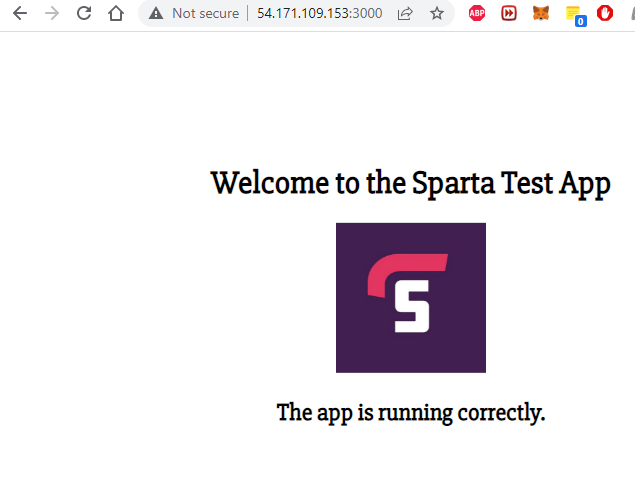

# Automating our EC2 Instance in AWS with ansible

In order to automate our AWS we need to make a YAML file to provision with and make a new set of keys.


Here is the YAML file, Put this in your etc/ansible directory inside your ansible controller, You can name it something like AWS_playbook .
```
---

- hosts: localhost
  connection: local
  gather_facts: true
  become: true

  vars:
    key_name: my_aws
    region: eu-west-1
    image: ami-09a9582ce47915c82 # https://cloud-images.ubuntu.com/locator/ec2/
    id: "james-ami-web-app"
    sec_group: "sg-0c142adde31febf50"
    subnet_id: "subnet-0429d69d55dfad9d2"

  tasks:

    - name: Facts
      block:

      - name: Get instances facts
        ec2_instance_facts:
          aws_access_key: "{{aws_access_key}}"
          aws_secret_key: "{{aws_secret_key}}"
          region: "{{ region }}"
        register: result

      - name: Instances ID
        debug:
          msg: "ID: {{ item.instance_id }} - State: {{ item.state.name }} - Public DNS: {{ item.public_dns_name }}"
        loop: "{{ result.instances }}"

      tags: always


    - name: Provisioning EC2 instances
      block:

      - name: Upload public key to AWS
        ec2_key:
          name: "{{ key_name }}"
          key_material: "{{ lookup('file','/home/vagrant/.ssh/my_aws.pub')}}"
          region: "{{ region }}"
          aws_access_key: "{{aws_access_key}}"
          aws_secret_key: "{{aws_secret_key}}"

      - name: Provision instance(s)
        ec2:
          aws_access_key: "{{aws_access_key}}"
          aws_secret_key: "{{aws_secret_key}}"
          key_name: "{{ key_name }}"
          id: "{{ id }}"
          group_id: "{{ sec_group }}"
          image: "{{ image }}"
          instance_type: t2.micro
          region: "{{ region }}"
          wait: true
          count: 1

      tags: ['never', 'create_ec2']

```
The following command can
ansible-playbook playbook.yml --ask-vault-pass --tags create_ec2
You should be able to connect to your app by using the following command whilst in `/etc/ansible`. Use the IPV4 address given to you in aws , in the instance connect tab.
```
ssh -i ~/.ssh/key_name ubuntu@ec2-54-171-109-153.eu-west-1.compute.amazonaws.com

```



## Troubleshooting

