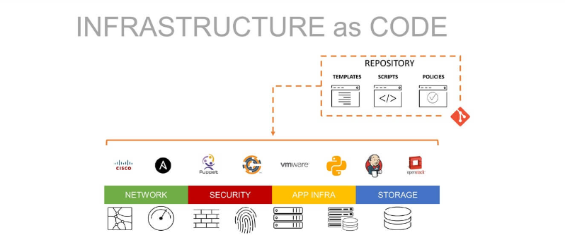

# Infrastructure as code

## Configuration management

This ConfigMgmt element focuses on inventorying existing IT assets. You should track all the assets relevant to your IT operations and application development environment. Then, the metadata of these systems should be stored in one central ConfigMgmt repository. 

You can now benchmark the apps, tools, and physical assets according to functional needs. For applications in the pipeline, benchmarking is done by running them in their test environment. 

Version control is the primary element of configuration management workflow. You can use any system like Git to track specification data of apps, tools, software, and physical assets. The pipeline version control system software helps roll back to the previously known exemplary configuration if an update causes any issues. 

## Orchestration

Orchestration addresses the needs to automate the lifecycle of environments. With infrastructure being codified, modifications of infrastructure are automated and Terraform is used to establish infrastructure across multi-cloud and on-prem data. It is also known for its use of a simple syntax, qualifying it as a prominent automation tool.

## Tools

There are a wide range of tools available such as Terraform , Ansible , AWS Cloudformation, Azure Resource manager, Google Cloud Deployment Manager and Puppet.

## Who is using it

IT adminsistrators, DevOps engineers, Software Testers

## Terraform Ansible

Ansible is a configuration and orchestration tool from Red Hat. The IaC tool focuses on automation and simplicity. It has a library of various ready-to-use default configurations, and you can start deploying apps without any manual setup in the beginning.

Terraform is the leader of IaCs in the current market scenario. Because the standard tool features are available for free. However, if you want managed services for enterprise needs, you can get paid subscriptions too. It supports most cloud platforms like GCP, Azure, and AWS.  

## On Premesis - Hybrid - Cloud

Many services exist such as AWS hybrid cloud that can manage a Hybrid environment as an alternative to purely cloud or an on premisis server such as AWS hybrid cloud services which deliver consistent AWS wherever it's needed – from the cloud, to on premises, and at the edge. 

## What other tools are 

## push configuration vs pull configuration

