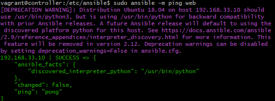

# Setting up Ansible

Firstly we need a vagrantfile to set up our oracle virtual boxes. The following code can be used to set up three virtual boxes one control, one database and one for our web server.

```
# ansible-tech201


# -*- mode: ruby -*-
 # vi: set ft=ruby :
 
 # All Vagrant configuration is done below. The "2" in Vagrant.configure
 # configures the configuration version (we support older styles for
 # backwards compatibility). Please don't change it unless you know what
 
 # MULTI SERVER/VMs environment 
 #
 Vagrant.configure("2") do |config|
    # creating are Ansible controller
      config.vm.define "controller" do |controller|
        
       controller.vm.box = "bento/ubuntu-18.04"
       
       controller.vm.hostname = 'controller'
       
       controller.vm.network :private_network, ip: "192.168.33.12"
       
       # config.hostsupdater.aliases = ["development.controller"] 
       
      end 
    # creating first VM called web  
      config.vm.define "web" do |web|
        
        web.vm.box = "bento/ubuntu-18.04"
       # downloading ubuntu 18.04 image
    
        web.vm.hostname = 'web'
        # assigning host name to the VM
        
        web.vm.network :private_network, ip: "192.168.33.10"
        #   assigning private IP
        
        #config.hostsupdater.aliases = ["development.web"]
        # creating a link called development.web so we can access web page with this link instread of an IP   
            
      end
      
    # creating second VM called db
      config.vm.define "db" do |db|
        
        db.vm.box = "bento/ubuntu-18.04"
        
        db.vm.hostname = 'db'
        
        db.vm.network :private_network, ip: "192.168.33.11"
        
        #config.hostsupdater.aliases = ["development.db"]     
      end
    
    
    end
```
The vagrantfile should go into the directory that is going to be used for these virtual boxes and then can be run by using GitBash to enter the directory and typing the command.

`vagrant up`

Once this has completed the dependencies need to be installed for ansible.

When you are in the directory for your vagrantfile, you can use the following command to enter your three vagrant boxes respectively.

```
vagrant ssh controller
vagrant ssh web
vagrant ssh db
```
Firstly update and upgrade
```
sudo apt update
sudo apt upgrade
```

```
sudo apt-get install software-properties-common
sudo apt-add-repository ppa:ansible/ansible ## only in controler
sudo apt-get install ansible
sudo ansible --version
```

To go into anisble use the following command

```
cd /etc/ansible
```


To shut down the vagrant box, you can right click on the box in oracle vm and click close , save state in order to save the state or if the box needs to be removed.

```
vagrant destroy
```

## How to get the ping response

once you are in your controler box `vagrant@controller:~$`, go into etc ansible with 

```
cd /etc/ansible
```

then use the following command

```
sudo ansible -m ping web
```
You should get the response that the ping has been successfull but may get an error instead if not properly configured.



### Solving empty hosts list problem


use the following command to edit the hosts file

```
sudo nano hosts
```

Ensure the following line is in the file


