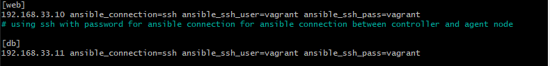
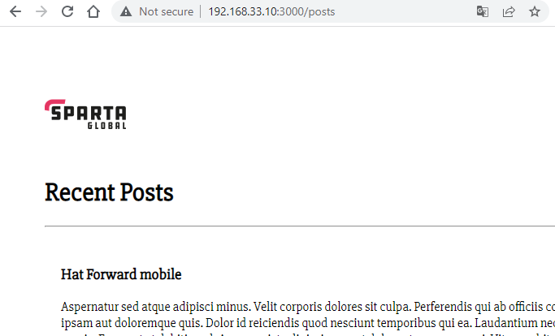

# Setting up Ansible

Firstly we need a vagrantfile to set up our oracle virtual boxes. The following code can be used to set up three virtual boxes one control, one database and one for our web server.

```
# ansible-tech201


# -*- mode: ruby -*-
 # vi: set ft=ruby :
 
 # All Vagrant configuration is done below. The "2" in Vagrant.configure
 # configures the configuration version (we support older styles for
 # backwards compatibility). Please don't change it unless you know what
 
 # MULTI SERVER/VMs environment 
 #
 Vagrant.configure("2") do |config|
    # creating are Ansible controller
      config.vm.define "controller" do |controller|
        
       controller.vm.box = "bento/ubuntu-18.04"
       
       controller.vm.hostname = 'controller'
       
       controller.vm.network :private_network, ip: "192.168.33.12"
       
       # config.hostsupdater.aliases = ["development.controller"] 
       
      end 
    # creating first VM called web  
      config.vm.define "web" do |web|
        
        web.vm.box = "bento/ubuntu-18.04"
       # downloading ubuntu 18.04 image
    
        web.vm.hostname = 'web'
        # assigning host name to the VM
        
        web.vm.network :private_network, ip: "192.168.33.10"
        #   assigning private IP
        
        #config.hostsupdater.aliases = ["development.web"]
        # creating a link called development.web so we can access web page with this link instread of an IP   
            
      end
      
    # creating second VM called db
      config.vm.define "db" do |db|
        
        db.vm.box = "bento/ubuntu-18.04"
        
        db.vm.hostname = 'db'
        
        db.vm.network :private_network, ip: "192.168.33.11"
        
        #config.hostsupdater.aliases = ["development.db"]     
      end
    
    
    end
```
The vagrantfile should go into the directory that is going to be used for these virtual boxes and then can be run by using GitBash to enter the directory and typing the command.

`vagrant up`

Once this has completed the dependencies need to be installed for ansible.

When you are in the directory for your vagrantfile, you can use the following command to enter your three vagrant boxes respectively.

```
vagrant ssh controller
vagrant ssh web
vagrant ssh db
```
Firstly update and upgrade
```
sudo apt update
sudo apt upgrade
```

```
sudo apt-get install software-properties-common
sudo apt-add-repository ppa:ansible/ansible ## only in controler
sudo apt-get install ansible
sudo ansible --version
```


To go into anisble use the following command

```
cd /etc/ansible
```


To shut down the vagrant box, you can right click on the box in oracle vm and click close , save state in order to save the state or if the box needs to be removed.

```
vagrant destroy
```

## How to get the ping response

once you are in your controler box `vagrant@controller:~$`, go into etc ansible with 

```
cd /etc/ansible
```

then use the following command

```
sudo ansible -m ping web
```
You should get the response that the ping has been successfull but may get an error instead if not properly configured.


### Solving empty hosts list problem


use the following command to edit the hosts file

```
sudo nano hosts
```

Ensure the following line is in the file

```
[web]
192.168.33.10 ansible_connection=ssh ansible_ssh_user=vagrant ansible_ssh_pass=vagrant
```
You can check this with the following command.
```
cat hosts
```


How to copy and send files in ansible


```
sudo ansible web -m copy -a "src=/etc/ansible/test.txt dest=/tmp/"
```

## How to start the app and database through the controller

YAML files need to be created to automatically clone and initiate our databases and app files. Firstly navigate to your directory with ansible and enter your controller virtual box. Use the following.

```
vagrant ssh controller
```
Now go into your ansible directory
```
cd /etc/ansible
```
We can use a series of commands here to check the status of our app and db for example, here we are specifying the db and within the brackets the command we want to use.

```
sudo ansible db -a "systemctl status mongodb"
```

This is where you can put your YAML files and also the ansible config file. Entering new details in the ansible config file may be necassery to get your app and database to connect.

```
sudo nano ansible.cfg
```
Make sure under defaults , host_key_checking = false. 


There is also the hosts file here. This must be edited to allow for our app and database IP addresses. There are also other options here like specifying the version of python.

```
sudo nano hosts

[web]
192.168.33.10 ansible_connection=ssh ansible_ssh_user=vagrant ansible_ssh_pass=vagrant

[db]
192.168.33.11 ansible_connection=ssh ansible_ssh_user=vagrant ansible_ssh_pass=vagrant

```



You can use the following to create YAML files for your App and DB respectively and start the YAML playbook with the ansible-playbook command.

```
sudo nano app-playbook.yml
sudo nano db-playbook.yml

sudo ansible-playbook app-playbook.yml
sudo ansible-playbook db-playbook.yml
```
## Cloning the app and database files

### Cloning DB
The app can be cloned using git clone in yaml
```
---
- hosts: web
  gather_facts: yes
  become: true

  tasks:
  - name: Cloning GIT
    git:
      repo: https://github.com/jamestcole/tech201_virtualisation.git
      dest: /home/app
      clone: yes
      update: yes
```

The database can be cloned using git clone in yaml

```
---
- hosts: db
  gather_facts: yes
  become: true

  tasks:
  - name: Cloning GIT
    git:
      repo: https://github.com/jamestcole/tech201_virtualisation.git
      dest: /home/db
      clone: yes
      update: yes
```


## Writing the YAML playbook

To start the file write `---` and settings to name the host, gather facts and grant admin access.

```
---
- hosts: web
  gather_facts: yes
  become: true
```

The tasks to be completed need to be specified Under this many different tasks can be specified, to start with install Nginx. when Writing this it is important to check each line is indented by two spaces. copying text may also make this unusable.

```
  tasks:
  - name: Install Nginx
    apt: pkg=nginx state=present update_cache=yes
```
the beginning of the file should look like this.


## Writing a YAML playbook for the app


## Writing a YAML playbook for mongodb and database configuration

Firstly make a new YAML file while in controller,etc/ansible
```
sudo nano mongodb-playbook.yml
```
Firstly we can start our playbook by specifying that it is the database 
```
---
- hosts: db
  gather_facts: yes
  become: true
```
Now we have to write the tasks to install mongodb, configure it and enable and start it.
```
  tasks:
  - name: install mongodb most latest version
    apt: pkg=mongodb state=present

  - name: remove mongodb file
    file:
      path: /etc/mongodb.conf
      state: absent

  - name: create mongodb config file
    file:
      path: /etc/mongodb.conf
      state: touch
      mode: u=rw,g=r,o=r

  - name: insert file
    blockinfile:
      path: /etc/mongodb.conf
      block: |
        storage:
          dbPath: /var/lib/mongodb
          journal:
            enabled:
        systemLog:
          destination: file
          logAppend: true
          path: /var/log/mongodb/mongod.log
        net:
          port: 27017
          bindIp: 0.0.0.0

  - name: Restart mongodb
    become: true
    shell: systemctl enable mongodb

  - name: enable mongodb
    become: true
    shell: systemctl enable mongodb

  - name: start mongodb
    become: true
    shell: systemctl start mongodb

```

